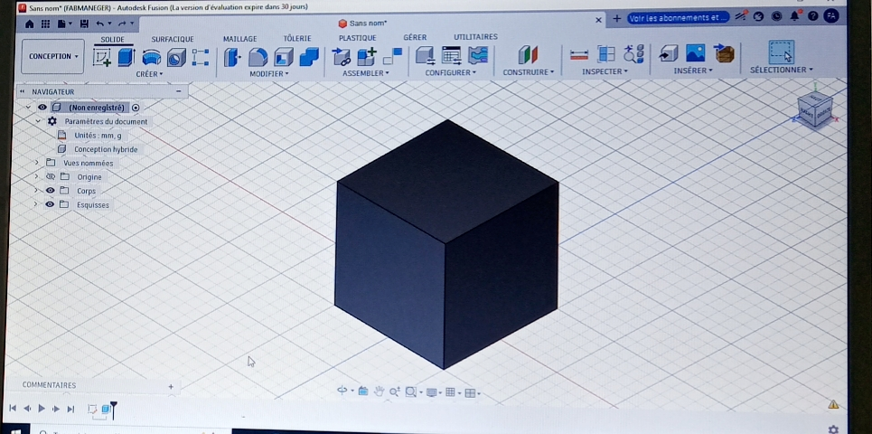

#  Journal - lundi 31-08-2026(rédigé par : Firdoss ABODJI)

## Fait aujourd'huit

- cette journée s'est déroulé avec la finalisation des projets et l'identification des materiels necéssaires pour chaque projet
- Nous avons parlé de la Fusion 360
- Pourquoi choir de Fusion 360
- L'esquisse
- La modélisation solide 
- La simulation

## Appris

- La Fusion 360 est un logiciel de CAO, FAO et IAO développé par Autodesk
- Il réunit modélisation 3D, simulation, rendu et fabrication dans un seul outil
- Il fonction dans le cloud : les projets sont sauvegardés et accessibles depuis n'importe quel appareil
- Il permet de suivre un projet du croquis initial jusqu'à la pièce usinée
- Fusion 360 est Base sur le cloud, Accessible aux étudiants et un communauté active 
- La fusion dispose également plusieur espace de travail telque Design, Render, Simulation et Manufacture
- Une esquisse est un dessin 2D tracé sur un plan: droites, cercles, rectangle, arc
- Les contraintes géométriques fixent les relations entre éléments 
- Une esquisse entièrement contrainte s'affiche en vert: elle sert alors de base fiable à la modélisation 3D
- On a appris également qu'il existe plusieur domaine d'utilisation de fusion 3D tel que l'ingénierie mécanique, impression 3D, robotique et drone
- Et en fin nous avons réalise un cube dans la fusion 3D

## Raté, puis cprrigé

- Aucour de l'instalation de fusion 360 j'avais eu des soucis au niveau de l'instalation et également au niveau de la réalisation d'un cube, sur tout la maitrise du dessin technique. j'ai été aidé par les formateur

## Décidé

- Nous avons décidé de pour suivre la formation 

##  A faire démain

- La continuité de la dormation sur l'utilisation de Fusion 360
