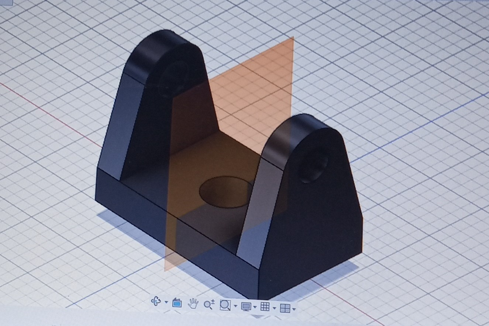
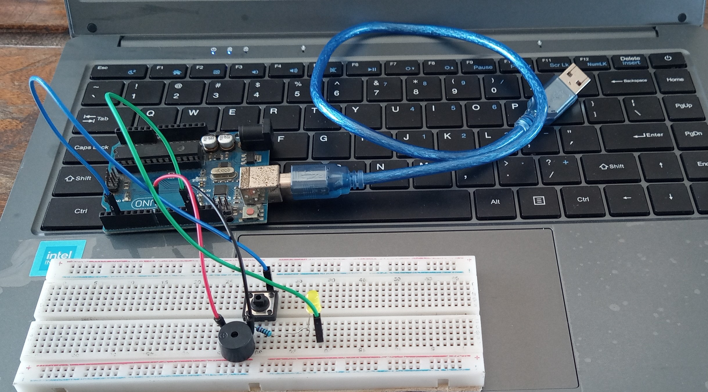

# Journal-mardi 01-09-2026(rédigé par ABODJI Firdoss)

## Fait aujourd'huit

- Nous avons debuté la journée d'aujourd'huit dans la salle de decoupe laser avec des modules comme: l'impression DTF, les materiels nécessaaire, les étapes du DTF et ces avantages
- Dans la salle de decoupe laser, nous avons parler de la maitrise de Breadboard SK10
- Au niveau de la salle d'électronique, nous avons parler du fonctionnement de l'arduino, du plaquette et la réalisation des differentes circuits
- nous avons également parler de l'utilisuion de Fusion
- comment imprimé une iamage 

## Appris

- Nous avons appris que le DTF a plusieurs avantages telque: il est multicolores et détaillés, compatible avec de nombreux textilles, pas d'écran à fabriquer et adapter à l'impression à l'unité
 - Nous avons égation apppris comment réalisé un circuit éléctrique avec breadboad, le microcontroleur, les led, le tansistor  les diodes et le buzzer
- nous avons également appris comment réalisé une modelisation d'une pièce et d'une porte clé à l'aide du logiciel Fusion 360

## Raté, puis corrigé

- Aucour de la modelisation d'une pièce avec la Fusion, j'ai été confronté à des difficultés. je n'arrivais pas à bien determiner les dimenssions du dessin technique et le formateur m'a bien expliqué

## Décidé

-La revision de la seance dernière et la poursuite de  la formation
 
 ## A faire démain

 - Nous avons décidé de poursuivre la formation dans les trois ateliers

