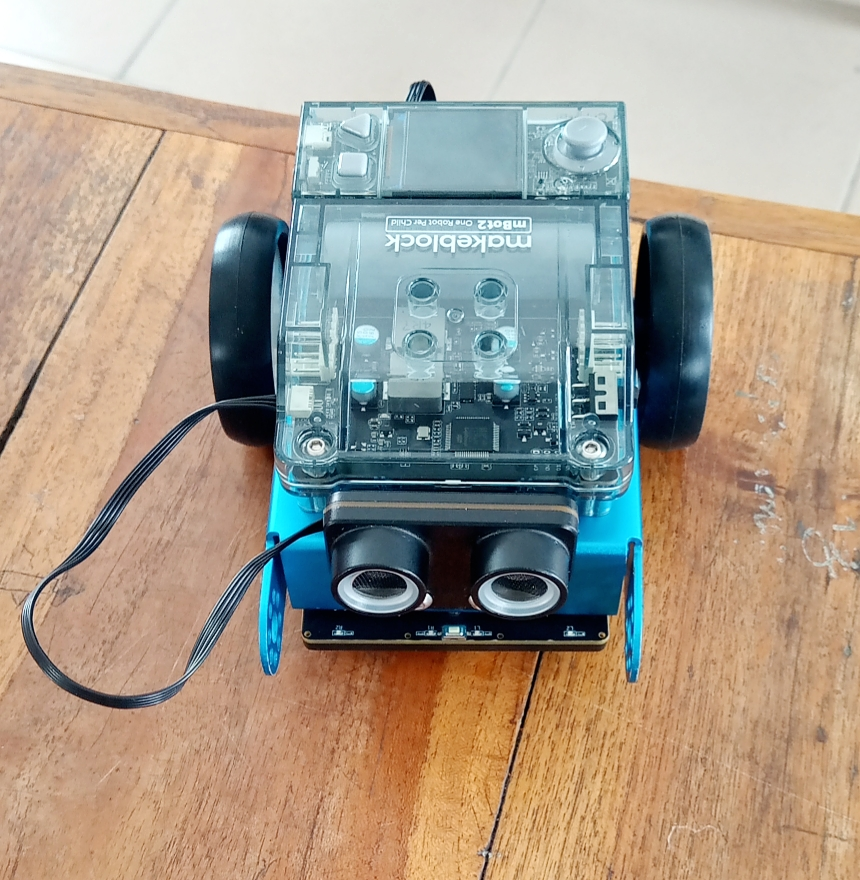
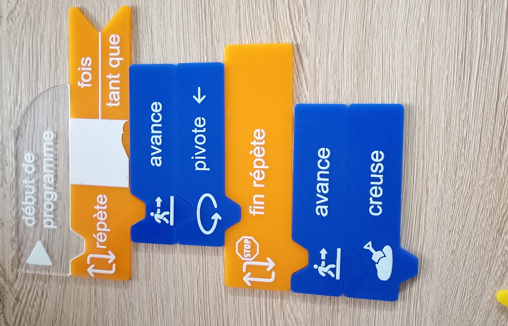

# Journal-Mercredi 02-09-2026 (rédigé par Firdoss ABODJI)

## Fait aujourd'huit
- La journée d'aujourd'huit a été consacrée à la consolidation des projets
- Qu'est-ce que l'algorithme, l'algorithmique
- Les trois critères qui définissent un algorithme
- L'utilisation des Robot mBot2
- Montage, demontage et le code du robot mBot2 

## Appris

- L'algorithme est une suite finie et non ambigue d'opération ou d'instructions permettant de résoudre un problème
- Une algorithmique est une domaine d'étude de l'algorithme
- On a egalement appris qu'il existe trois critères qui deffinissent un algorithme: une suite ordonnée d'instruction, un nombre fini d'étapes et des instructions précis, qui resolvent un problème donné
- Pour donner un code au robot on utilise le mBot2 
 
 

## Raté, puis corrigé

- Au niveau de rassemblage du robot, on a renversé le cablage et le robot a commencé par roulé dans le sens inverse
- On a essayé de renverser certains cable

## Décidé

- Nous avons décidé de reprendre a fin de bien maitriser

## A faire demain

- Pour suivre la formation avec les differnt projet

