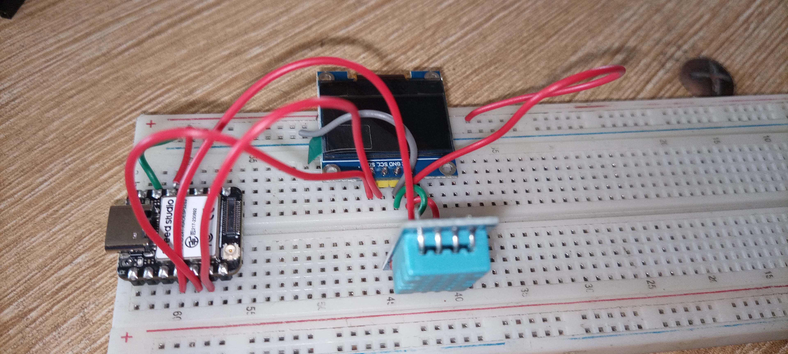

# Journal-samedi 05-09-2026(Rédigé par Firdoss ABODJI)

## Fait aujourd'huit

- La journée d'aujourd'huit s'est consacré à la XIAO ESP32-S3
- Le choix de l'IDE Thonny
- Le flashage de firmware MicroPython sur une  XIAO ESP32S3
- Cablage d'un capteur DHT11 et un écran OLED SSD1306
- Installation d'une bibliothèque externe MicroPython via le gestionnaire de paquet de thonny
- L'installation et la configuration l'IDE Thonny pour programmer une carte ESP32 en MicroPython
 

## Appris

- XIAO ESP32-S3 est un microcontroleur compact, asseez puissant pour gérer plusieurs périphériques en parallèle tout en restant simple à programmer en MicroPython
- Elle permet de construire, en une séance, un prototype complet de station de mesure autonome avec affichage local
- Chaque pine a un role très specifique 
- Un capteur mesure la température et l'humidité
-Ecan un affichage local des mesures

## Raté, puis corrigé

- le circuit électrique réalisé aujourd'huit avec le ESP32, d'un capteur et d'un écran, était une reussit

## Décidé

- j'ai décidé de m'exercé et de faire plus des recherches a fin d'acquerir plus de competance

## A faire démain

- Poursuivre la formation sur la conception des differents projets

