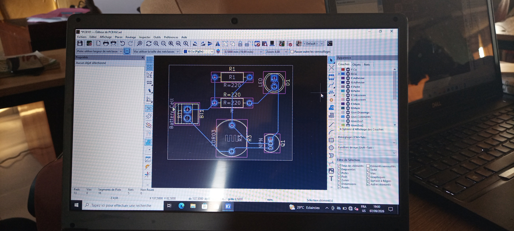

# journal- lund 27-08-2026 ( rédigé par: Firdoss ABODJI)

## Fait aujourd'huit

- La journée d'aujourd'huit ses consacrée sur le cours d'initiation aux PCB
- Comprendre le PCB
- L'anatomie d'un PCB
- Pourquoi passer du prototype au PCB

## Appris

- Le PCB signifie Printed Circuit Board, ou circuit imprimé
- IL sert  à supporter, connecter et organiser les composants électroniques
- Les connexions électroniques sont réalisés grace aux pistes en cuivre
- On en retrouve les PCB souvent dans les appareils tels que les Arduinos, smartphones, les ordinateurs, des drones, les équipements industriels et les objes lot
-  Un circuit imprimé peut compoerter un ou plusieurs couches
- Il permet également de transformer l'experience en une carte électronique réelle
- Un PCB est constitué d'un substrat qui est le matériau mécanique de la carte, souvent FR-4; du cuivre qui forme des pistes; solder mask qui protège le cuivreet limite les cours-circuits; pads, zone destinée à la soudure des composants; vias et mounting holes pour fixer la carte
- Il est très important de passé de Breadboart au PCB car célà permet de tester rapidement une idée, reduire la taille de cablage,Connexion solides et répétables, meilleur résistance aux vibrations, fabrication en plusieurs exemplaires

## Raté, puis corrigé

- Aucours de la conception d'un circuit imprimé, j'avais eu un problème d'affichage des composants électroniques. Célà est du à la version installé dans mon pc et j'ai été obligé de faire un niveau installation

## Décidé

- j'ai également décidé de m'exercer pour pouvoir maitrisser

## A faire démain

- Nous avons décidé de poursuivre la formation sur la suite de ce module et la finalisation des projets de chaque groupes
 
