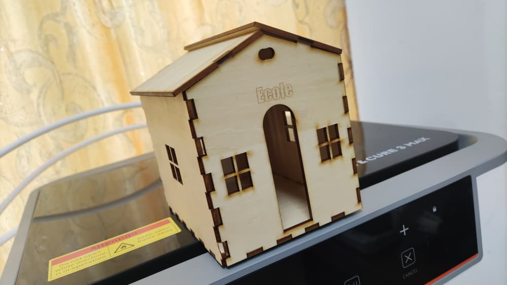

# journal- Mardi 08-09-2026 ( rédigé par: Firdoss ABODJI)

## Fait aujourd'huit

- Aucour de cette journée, nous avons parlé de CAO, FAO, 
- Les differents machines CNC
- De la CAO à la pièce usinée
- Le module FAO de Fusion 360
- Stratégie & paramètre d'usinage
- Simulation, post-traitement & bonnes pratique
- Travail sur le projet

## Appris

- La FAO signifie Fabrication Assistée par l'ordinateur(en anglais CAM, computer- Aided Manufacturing)
- La FAO est le processus qui transforme un modèle 3D conçu en CAO en instruction exploitables par une machine-outil à commende numérique. Le logiciel calcule des trajectoires d'outil, puis génère un programme que la machine exécute pour rétirer de la matière et obtenir la pièce finale 
-  Il calcule des trajectoires d'outil précises à partir de la géométrie 3D 
- La FAO simule l'usage avant tout passage réel en machine 
- Il génère un code machine adapté au controleur CNC
- CNC signifie Cammande Numérique par calculateur ou computer Numeral control. Une machine CNC déplace un outil selon des axes motorisés, en suivant précisement le programme généré par la FAO
- La Fusion 360 reunit CAO, FAO, simulation et conception électronique dans un seul logiciel basé sur le cloud. Le passage du modèle 3D à la programmation CNC se fait sans changer d'outil ni export de fichiers
- Les differents paramètres de coupe clés sont la vitesse de coupe, d'avance, la profondeur de passe et engagement radial
- Pour une bonne conduite des CNC, il faut toujours simuler avant l'usinage réel, adapter les paramètres au matériaux et à l'outil, sécuriser le brut et l'origine pièce, vérifier le post-processeur utilisé
- On a également appris que la fusion 360 unifie CAO et FAO dans un seul environnement,du modèle 3D au G-code.
- Aucour de la reflexion sur notre projet, nous avons fait la conception d'une école avec le decoupe laser 

## Raté, puis corrigé

- Cette journée a été remarque par des erreurs que nous avons commus, au niveau de la conception sa été très compliqué et également la rapité du formateur. j'étais obligé de lui rappelé de tant en tant 

## Décidé

- j'ai décidé de m'exercer a fi de bien maitriser et m'ameliorer

## A faire démain

- Continuer la formation et poursuivre la realisation de nos projet
