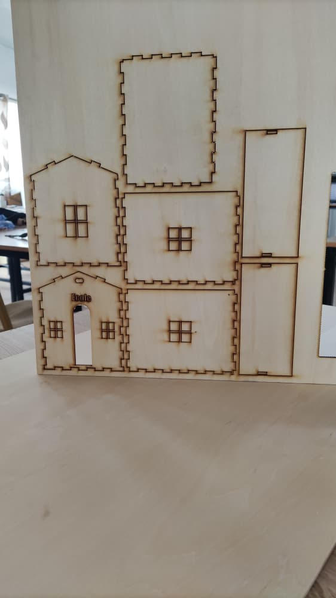
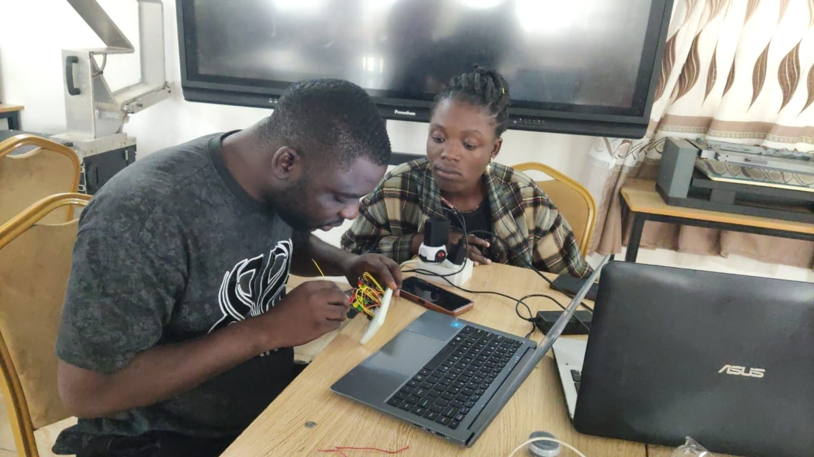

# Journal-Jeudi 10-09-2026(Rédigie par: Firdoss ABODJI)

## Fais aujourd'huit

- La journée d'aujourd'huit est consacrée à l'élaboration de notre projet: Maquette Pédagogique interactive D'un Carrefour de Sécurité Routière
- Réalisation d'un circuit électrique comportant un XIAO ESP32S3, des feux tricolores, des fils de connexion et un code python pour allumer ces feux tricolores
- l'impression d'un boitier avec l'impression 3D

## Appris

- Aucours de cette journée, j'ai compris qu'il y a une difference entre la théorie et la pratique
- j'ai également appris qu'avec XIAO ESP32S3? on peut faire plusieurs programmation, donc un microcontroleur puissant
- Nous avons également appris qu'on peut faire allumé les feux tricolores avec du python, C++

## Raté, puis corrigé

- Aucour de la réalisation de notre projet, on a eu des difficulté telque la programmation en python pour l'allumage des feux, le dimensionnement pour pouvoir faire le decoupe laser
- toute ces erreurs ont été resulus après plusieur tantative et grace à l'aide du formateur

## Décidé

- Nous avons décidé de s'exercé pour pouvoir bien maitrisé la programmation

## A faire démain

- pour suivre la réalisation de notre projet