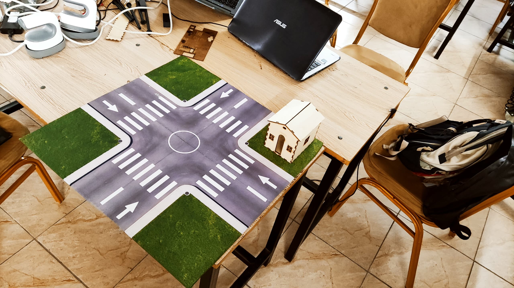
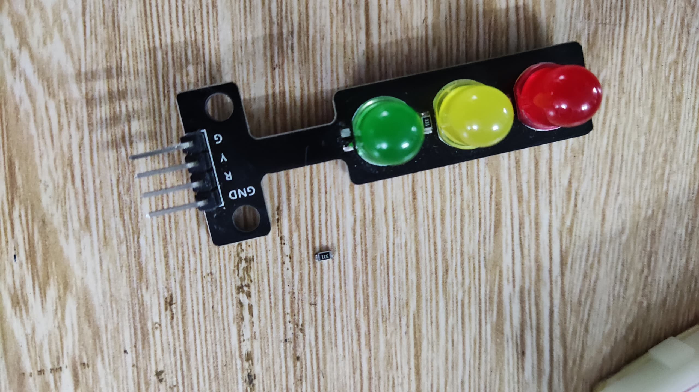
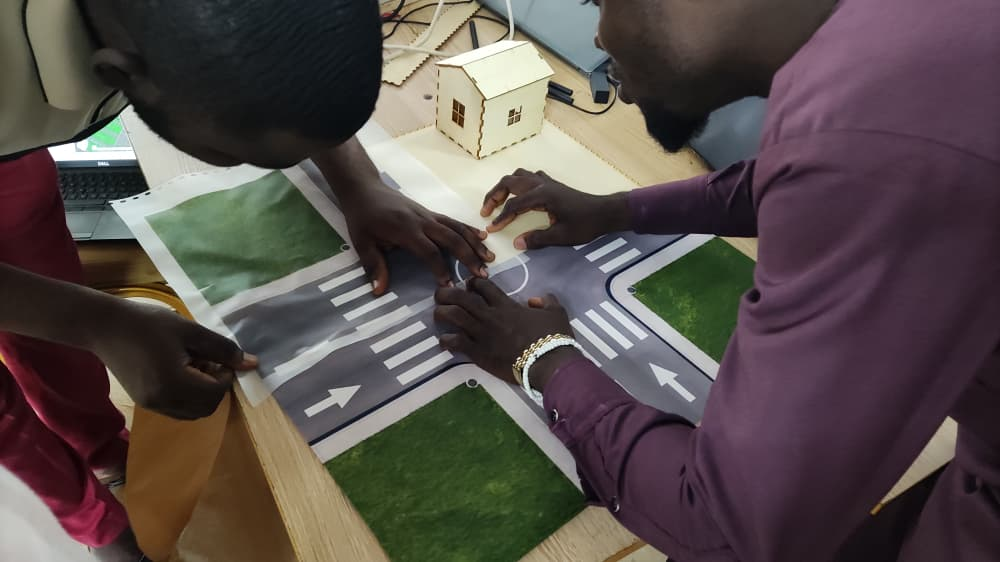
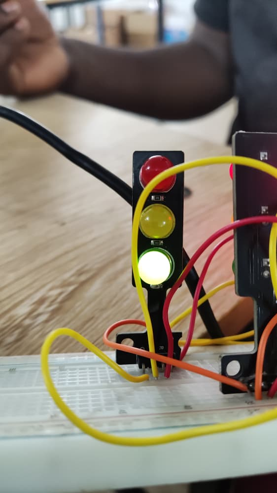
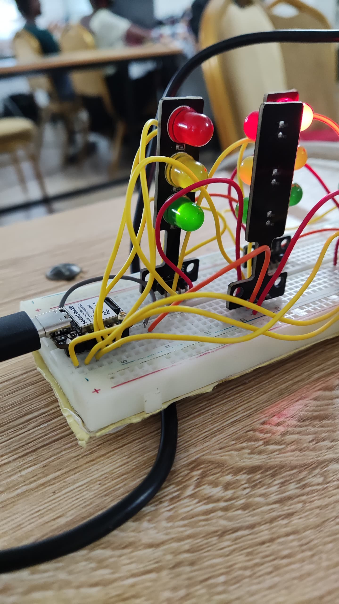
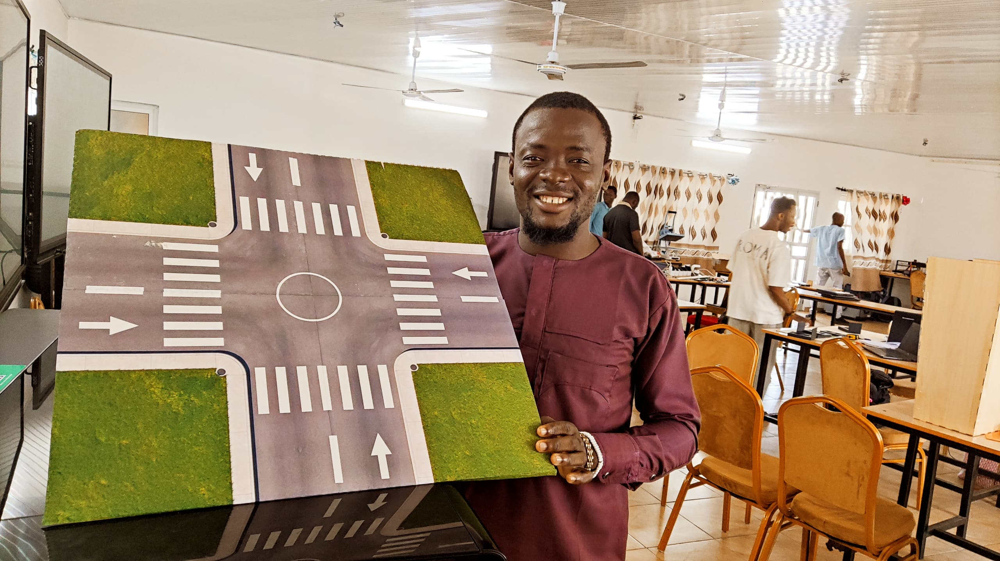

# Journal- Vendredi 11-09-2026(Redigé par Firdoss ABODJI)

## Fait aujourd'huit

- la decoupe laser des planche pour  pouvoir modelisé notre carefour  
- Le montage des feux tricolores avec le ESP32S3 sur le bread boad
- Soudure des LED
- Utilisation du perceuse à fin de pouvoir percer et faire passé des fils de connexion sur la maquette

## Appris

- Aucour de nos manipulation, nous avons appris comment créer un code avec le logiciel  pour faire fonctionner les feux tricolores
- comment faire du cablage avec XIAO ESP32S3 pour allumé un feu tricolores et son fonctionnement

## Raté, puis du coorigé

- Aucour de le réalisation des feux tricolores, nous avons constaté que les LED vertes s'allumaient très faiblement.  On a dus retiré les ristances au niveau de ces LED pour avoir les meme eclairages

## Decidé

- Au niveau des feux tricolores, nous avons constaté apprès avoirs retiré des resistances aux LED vertes, elles ont les memes éclairage. celè signifie que les LED vertes ont une tension seuil plus élévé que ceux en rouges et en orange

## A faire démain

- Nous avons prevus de faire le PCB pour notre circuit électrique 
- Des voiturettes avec l'impression 3D
- Un boitier pour ensemblage de notre circuit 