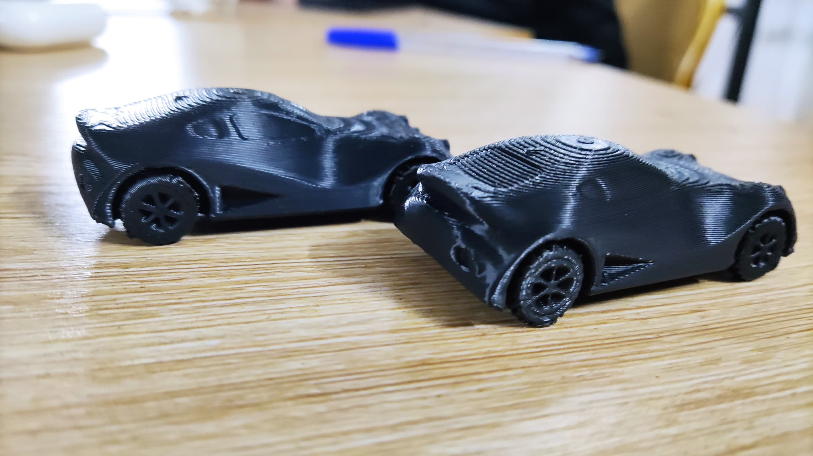

# Journal Lundi 14-09-2026(Rédigé par Firdoss ABODJI)

## Fait aujourd'huit

- Utilisation de fer à soudé
- La correction du PCB
- l'impression des voitures avec Bambu Lab A1
- l'instalation des pièces sur le nouveau PCB
- Modelisation d'une boit d'assemblage
- L'utilisation de l'étain 
 
 

## Appris

- Aucour de la journée d'aujourd'huit, nous avons appris qu'il est très important après chaque realisation du PCB, pour l'imprimer il faut faire l'inverse ou mirroir
- La modelisation de la boite nous permetra d' assemble tous le cablage de notre circuit
 
 .jpg>)

## Raté, puis corrigé

- Comme tous les jours, aucour de cette journée nous avons raté la réalisation du PCB. Celà est dus au faite que nous avons renversés les pines de XIAO ESP32S3 et après constat, célà a été corrigé

## Décidé

- Nous avons décidé de poursuivre la réalisation de notre projet

## A faire démain

- Faire l'assemblage ou le cablage  de notre projet  