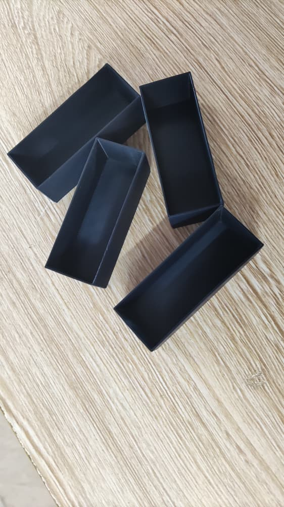
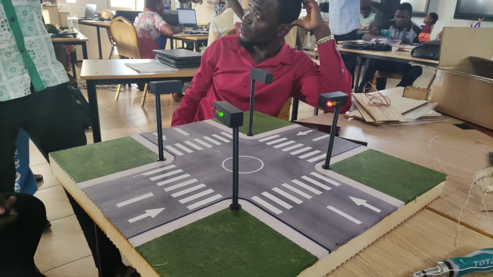
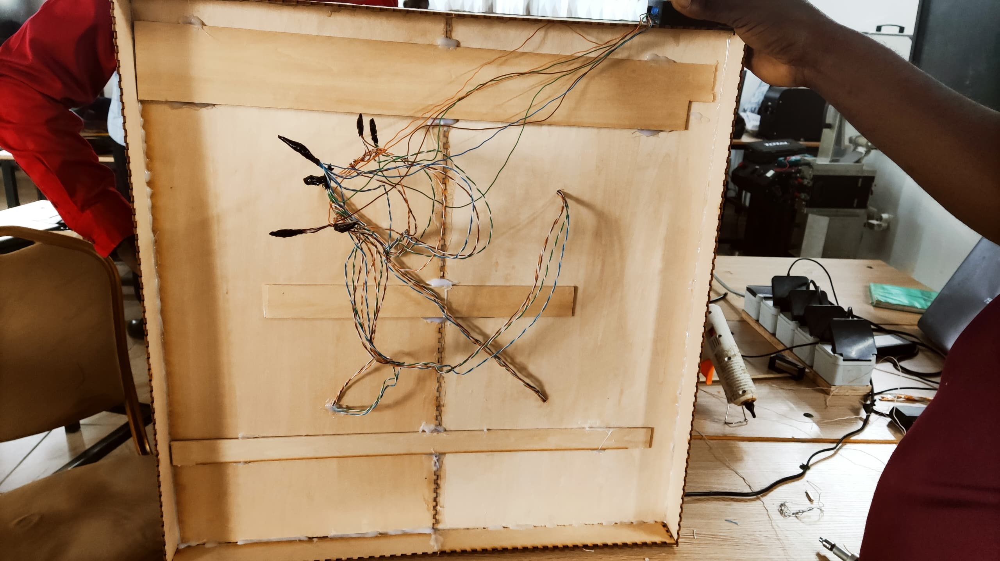
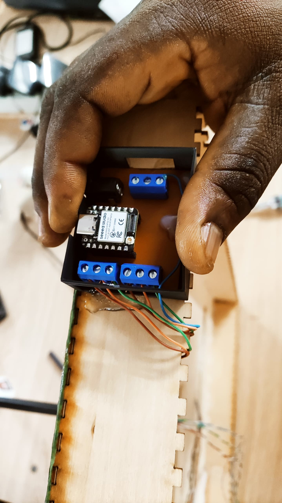
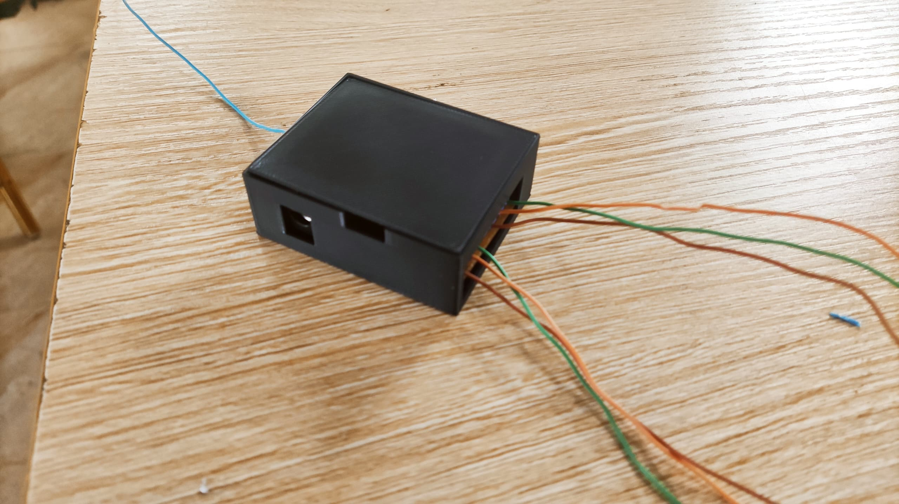
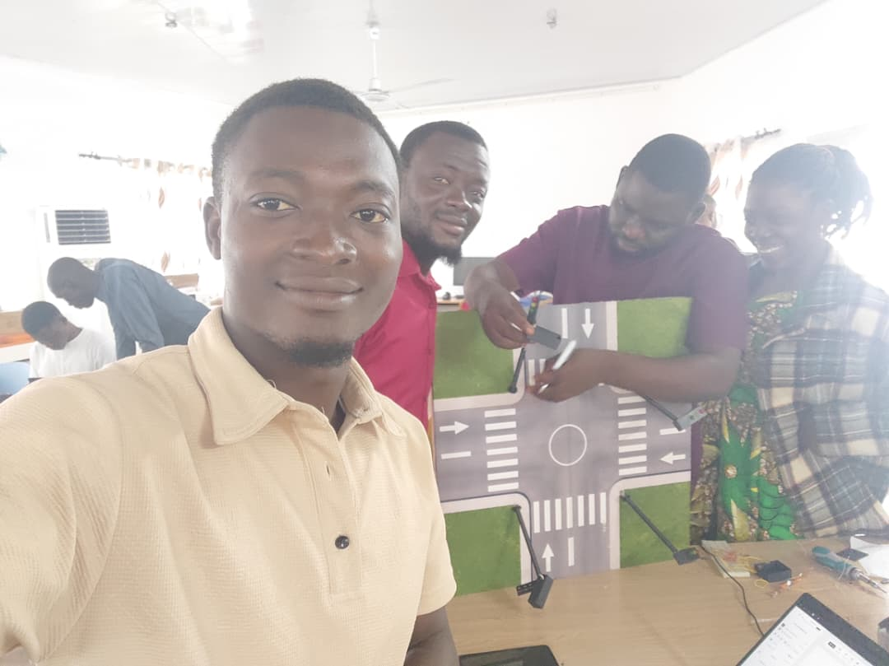

# Journal Mardi 15-09-2026(Redigé par Firdoss ABODJI)

## Fait aujourd'huit

- Le cablage de notre circuit
- La correction de la modelisation de la boite de PCB
- Collage des feux tricolores sur la plaquette
- La correction de la modelisation des boites des feux tricolores 

## Appris

- Aucour de cette journée, nous avons appris comment positionné les feux tricolores dans un carrefour à quatre rues
- Comment fonctionne le PCB des  feux tricolores 
- Comment faire du cablage pour faire fonctionner un feux tricolores à quatre rues  
 
 
 
 
 
 
 
 

## Raté, puis corrigé

- Nous avons ratés le perssage des ouvertures des boites des feux tricolores et celui du PCB aucour de la modelisation
- Toutes ces erreurs ont été corrigée aucour du cablage 

## Décidé

- Nous avons décidé de poursuivre notre projet et sa documentation

## A faire démain

- La recapitulation de notre projet, schéma et circuit
- La documentation du projet 