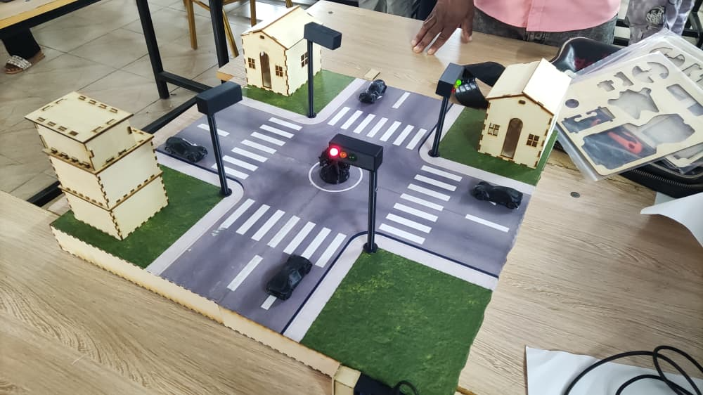

# Journal Jeudi 17-09-2026(Rédigé par Firdoss ABODJI)

## Fait aujourd'huit

- La correction du code de l'allumage des feux tricolores
- L'essaie du maquette des feux tricolores
- Le powerpoint pour la soutenance

## Appris

- Compétences Numériques, Programmation Embarquée
- Gestion des erreurs de compilation was not declared in this scope par déclaration de prototypes de fonctions.
- Implémentation du cycle sécurisé avec rouge intégral 4s et orange clignotant clignoteOrange() avant passage au rouge.
- Utilisation de l'IDE Arduino, sélection de carte XIAO ESP32S3, vérification sur port COM5, lecture des messages d'erreur

## Raté, puis corrigé

- Erreur compilation : expected ',' or ';' before ')' token sur ligne D0); (voir capture PC)
- Correction syntaxe : const int A_ROUGE = D0; sans parenthèse. Test de compilation OK sur COM5
- Code bloqué : was not declared in this scope pour clignoteOrange et toutRouge
-  Ajout des prototypes en haut du code : void clignoteOrange(...); avant setup()
- delay(3000) orange fixe pas pédagogique
-  Création fonction clignoteOrange(R,O,V,5) avec boucle for 400ms ON/OFF x5. Plus visible pour les élèves

## Décidé
- Suite à l'erreur de compilation D0, nous avons corrigé la syntaxe et validé l'utilisation des pins D0-D5 de la XIAO ESP32S3. Le choix est justifié par FC3 (6 GPIOs max). Validé par compilation sans erreur.
-  Pour améliorer la sécurité et l'aspect pédagogique, nous avons remplacé l'orange fixe par un orange clignotant 4 fois (400ms). Cela respecte la norme routière et attire l'attention avant le rouge intégral de 2s.

## A Faire démain

- Soutenance de notre projet 
- Fin du projet