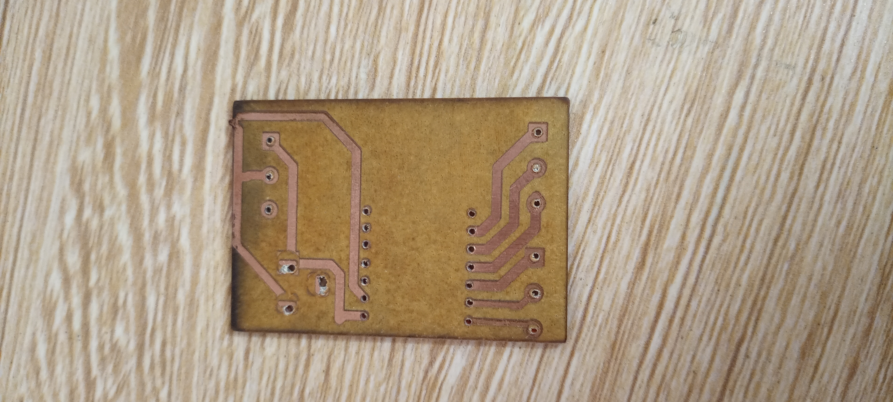

# Journal du Samedi 12-09-2026(Rédigé par Firdoss ABODJI)

## Fait Aujourd'huit

- Réalisation d'un PCB avec le Kicard
- Impression du PCB avec la machine Xtool P2S
- Construction de voiturettes avec le logiciel Xtool et     leurs impressions sur la machine Xtool H2S 

## Appris

- Nous avons appris qu'il est très important de maitrisser les onglets de KiCard pour faire bien le choix des pièces 
- On a également appris comment fonctionne le PCB du feux tricolores

## Raté, puis corrigé

- Aucour de la realisation du PCB des feux tricolores nous avons eu des difficultés, surtout le choix des pièce sur KiCard
- Difficulter liés aux symbles jack femmelle

## Décidé

- Nous avons décidé de faire des exerces similaires à fin de bien maitriser le logiciel Kicart 

## A faire demain

- L'installation des feux tricolores sur la maquette 
- la finition de notre projet qui porte sur la maquette pédagogique interactive d'un carrefour de sécurité routière